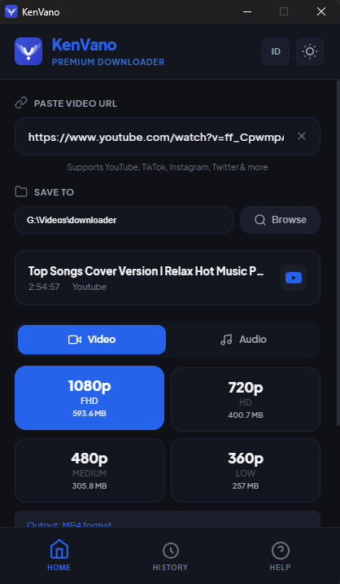

# KenVano Premium Downloader

**KenVano** adalah aplikasi komputer yang dirancang khusus untuk membantu Anda mengunduh video dan musik favorit dari media sosial dengan cara yang paling mudah, cepat, dan elegan.

## 🚀 Mengapa Memilih KenVano?
- **Sangat Ringan**: Aplikasi ini berukuran kecil dan tidak memperlambat kinerja komputer Anda saat digunakan.
- **Tampilan Premium**: Desain modern yang nyaman di mata dengan dukungan Mode Gelap (*Dark Mode*) secara otomatis.
- **Bebas Ribet**: Mesin pengunduh selalu diperbarui secara otomatis di latar belakang. Anda tinggal pakai, biar kami yang urus pembaruannya.
- **Dua Bahasa**: Tersedia dalam Bahasa Indonesia dan Inggris yang bisa diganti dalam satu klik.

## ✨ Fitur Unggulan
- **Unduh dari Mana Saja**: Mendukung YouTube, TikTok (tanpa watermark), Instagram (Reels), Twitter (X), Facebook, dan ribuan situs lainnya.
- **Video Kualitas Tinggi**: Pilihan kualitas video jernih, mulai dari kualitas standar hingga Full HD (1080p).
- **Simpan sebagai Musik (MP3)**: Ingin lagu saja? Anda bisa langsung mengubah video apa pun menjadi file MP3 berkualitas tinggi.
- **Riwayat Unduhan**: Aplikasi mengingat apa yang Anda unduh. Anda bisa membuka folder penyimpanan atau menghapus file langsung dari dalam aplikasi.

## 📖 Cara Penggunaan (Sangat Mudah!)
1. **Pilih Lokasi Simpan**: Klik tombol **Telusuri** untuk memilih di folder mana hasil unduhan akan disimpan.
2. **Tempel Link**: Salin alamat video dari browser atau aplikasi Anda, lalu tempelkan di kotak input KenVano.
3. **Pilih Format**: Setelah informasi video muncul, pilih apakah Anda ingin **Video** atau **Audio (MP3)**, lalu pilih kualitasnya.
4. **Download**: Klik tombol **Unduh** dan tunggu hingga selesai. File Anda siap dinikmati!

---
**Catatan Penting:**
*Gunakan aplikasi ini secara bijak. Harap hargai hak cipta para konten kreator dan gunakan hasil unduhan hanya untuk keperluan pribadi.*

Developed with ❤️ by **CandraSP**
